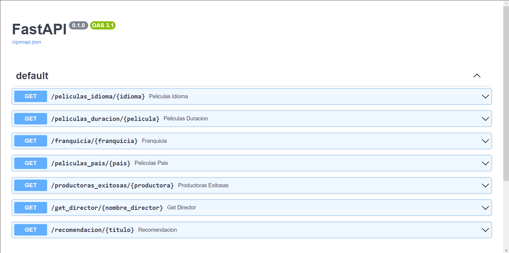
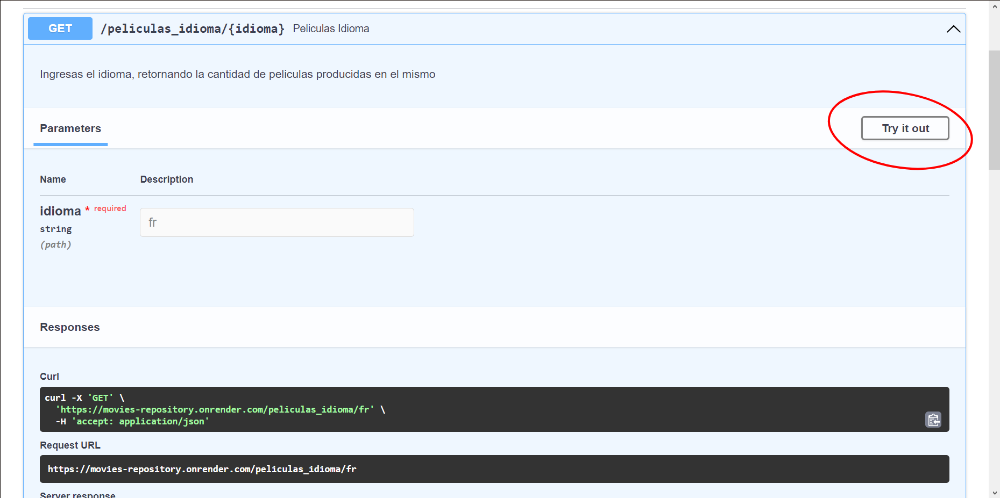
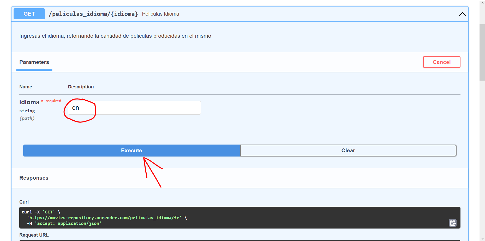
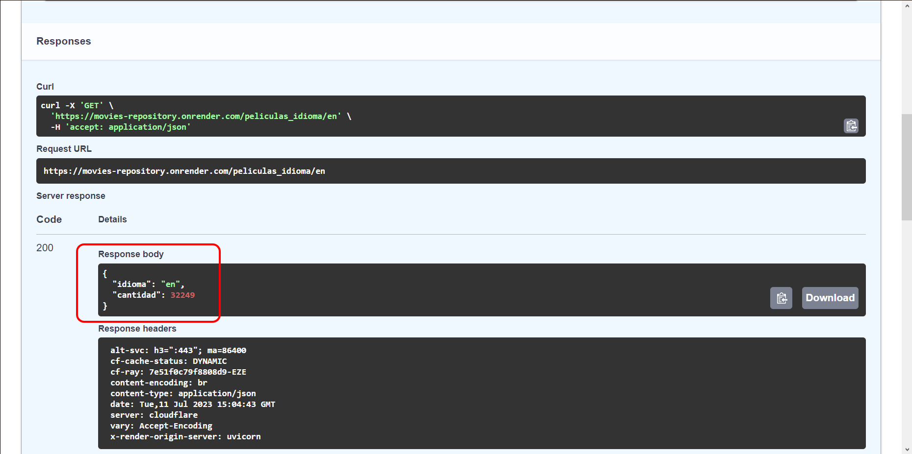

# Movies Repository

Machine Learning Operations (MLOps)

## Descripción

Este proyecto se enfoca en el tratamiento de un Dataset de películas y el despliegue de distintos endpoints, incluyendo un modelo de recomendación de películas.

## Características principales

- **FastAPI**: un framework de desarrollo web de alto rendimiento para construir los endpoints del proyecto ([enlace](https://fastapi.tiangolo.com)).
- **Render**: una plataforma de alojamiento y despliegue de aplicaciones web, para implementar y alojar el proyecto ([enlace](https://render.com)).
- **Datasets**: Se hace uso de los Datasets disponibles en el siguiente enlace: [Datasets](https://drive.google.com/drive/folders/1nvSjC2JWUH48o3pb8xlKofi8SNHuNWeu) para el análisis y entrenamiento del modelo de recomendación de películas.
- **Diccionario de datos**: El diccionario de datos utilizado se encuentra disponible en el siguiente enlace: [Diccionario de datos](https://docs.google.com/spreadsheets/d/1QkHH5er-74Bpk122tJxy_0D49pJMIwKLurByOfmxzho/edit#gid=0) y proporciona información sobre las variables y su significado en el Dataset **movies_dataset**.

## Requisitos

- Tener Python 3.x instalado en tu sistema.
- Ejecutar el siguiente comando en la terminal para instalar las bibliotecas requeridas:

  ```bash
  pip install -r requirements.txt
Asegúrate de estar ubicado en el directorio del proyecto donde se encuentra el archivo **requirements.txt**

Este comando instalará automáticamente todas las bibliotecas necesarias en tu entorno virtual.

Si aún no tienes Python instalado, puedes descargarlo e instalarlo desde el sitio oficial de Python: https://www.python.org.

## Guía de Uso de las APIs

A continuación se detallan las diferentes APIs disponibles en el proyecto y cómo utilizarlas.

### API: `peliculas_idioma`

Esta API devuelve la cantidad de películas en el idioma especificado.

- **URL**: `https://movies-repository.onrender.com/peliculas_idioma/{idioma}`
- **Método**: GET
- **Parámetros**:
  - `idioma`: El idioma de la cantidad de películas que deseas obtener.
- **Ejemplo de uso**: `https://movies-repository.onrender.com/peliculas_idioma/en`

### API: `peliculas_duracion`

Esta API devuelve el nombre, su duración en minutos y el año de estreno de una película específica.

- **URL**: `https://movies-repository.onrender.com/peliculas_duracion/{pelicula}`
- **Método**: GET
- **Parámetros**:
  - `pelicula`: El nombre de la película para la cual deseas obtener la duración.
- **Ejemplo de uso**: `https://movies-repository.onrender.com/peliculas_duracion/Jumanji`

### API: `franquicia`

Esta API devuelve información sobre una franquicia de películas, su nombre, cantidad de películas, ganancias totales y ganancias promedio.

- **URL**: `https://movies-repository.onrender.com/franquicia/{franquicia}`
- **Método**: GET
- **Parámetros**:
  - `franquicia`: El nombre de la franquicia de películas que deseas obtener información. Todas estas franquicias terminan con **Collection**.
- **Ejemplo de uso**: `https://movies-repository.onrender.com/franquicia/Toy Story Collection`

### API: `peliculas_pais`

Esta API devuelve la cantidad de películas producidas en el pais especificado.

- **URL**: `https://movies-repository.onrender.com/peliculas_pais/{pais}`
- **Método**: GET
- **Parámetros**:
  - `pais`: El nombre del país para el cual deseas obtener la cantidad de películas producidas.
- **Ejemplo de uso**: `https://movies-repository.onrender.com/peliculas_pais/United States of America`

### API: `productoras_exitosas`

Esta API devuelve información sobre una productora, su nombre, ganancias totales y la cantidad de peliculas producidas.

- **URL**: `https://movies-repository.onrender.com/productoras_exitosas/{productora}`
- **Método**: GET
- **Parámetros**:
  - `productora`: El nombre de la productora de películas que deseas obtener información.
- **Ejemplo de uso**: `https://movies-repository.onrender.com/productoras_exitosas/Pixar Animation Studios`

### API: `get_director`

Esta API devuelve información sobre un director de películas, su nombre, el retorno total en sus peliculas y un diccionario con informacion de sus peliculas.

- **URL**: `https://movies-repository.onrender.com/get_director/{nombre_director}`
- **Método**: GET
- **Parámetros**:
  - `nombre_director`: El nombre del director que deseas obtener información.
- **Ejemplo de uso**: `https://movies-repository.onrender.com/get_director/Steven Spielberg`

### API: `recomendacion`

Esta API devuelve una lista de 5 películas similares al título especificado, en forma de recomendación.

- **URL**: `https://movies-repository.onrender.com/recomendacion/{titulo}`
- **Método**: GET
- **Parámetros**:
  - `titulo`: El título de la película para la cual deseas obtener recomendaciones.
- **Ejemplo de uso**: `https://movies-repository.onrender.com/recomendacion/Toy Story`

---

Recuerda reemplazar `{idioma}`, `{pelicula}`, `{franquicia}`, `{pais}`, `{productora}`, `{nombre_director}`, y `{titulo}` en las URLs con los valores reales que deseas utilizar.
Si quieres investigar los distintos valores que puedes utilizar te recomiendo que revises el Dataset movies_dataset_new en la raiz del proyecto.

Utiliza estas URLs en tu navegador web.

Otra opción es usar la interfaz gráfica que nos proporciona FastAPI para llamar a las funciones: https://movies-repository.onrender.com/docs




